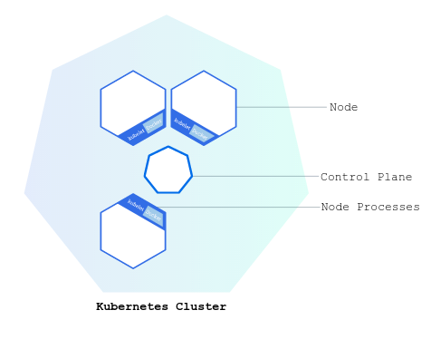

# Intro K8s

## Kubernetes & Container Orchestration

Kubernetes mengoordinasikan klaster komputer ketersediaan tinggi (_highly available_) yang saling terhubung sebagai unit tunggal. Abstraksi pada Kubernetes mengizinkan kamu untuk men-_deploy_ aplikasi terkemas (_containerized_) ke sebuah klaster tanpa perlu membalutnya secara spesifik pada setiap mesin. Untuk menggunakan model baru _deployment_ ini, aplikasi perlu dikemas dengan cara memisahkan mereka dari hos individu: mereka perlu dikemas. Aplikasi terkemas lebih fleksibel dan tersedia dibanding model _deployment_ lama, dimana aplikasi dipasang secara langsung didalam mesin spesifik sebagai paket yang sangat terintegrasi dengan hos. Kubernetes mengotomasisasikan distribusi dan penjadwalan kontainer aplikasi sebuah klaster secara menyeluruh dengan cara yang lebih efisien. Kubernetes merupakan platform _open-source_ dan siap produksi.

Klaster Kubernetes terdiri dari 2 tipe sumber daya:

- **Master** mengoordinasikan klaster
- **Node** adalah pekerja (_worker_) yang menjalankan aplikasi

### Diagram Klaster

Pada gambar diatas, terdapat beberapa bagian yang dapat diperhatikan.

**Master Node** mempunyai kewajiban untuk mengelola klaster. Master mengoordinasikan semua aktifitas di klaster kamu, seperti penjadwalan aplikasi, pemeliharaan keadaan (_state_) aplikasi yang diinginkan, _scaling_ aplikasi, dan _roll-out_ pembaharuan.Master mempunyai kewajiban untuk mengelola klaster. Master mengoordinasikan semua aktifitas di klaster kamu, seperti penjadwalan aplikasi, pemeliharaan keadaan (_state_) aplikasi yang diinginkan, _scaling_ aplikasi, dan _roll-out_ pembaharuan.

Komponen pada *master node* biasanya terdiri dari kube-apiserver, kube-controller-manager, kube-scheduler, dan etcd yang sering dikelompokkan menjadi satu istilah, yaitu **Control Plane**.

**Node** merupakan VM atau komputer fisik yang berfungsi sebagai mesin pekerja dalam klaster Kubernetes. Setiap node mempunyai Kubelet, sebuah agen untuk mengatur Node dan komunikasi dengan Kubernetes master. Node juga harus mempunyai alat untuk menangani operasi kontainer, seperti Docker atau rkt. Sebuah klaster Kubernetes yang menangani trafik produksi harus mempunyai minimal 3 Node.

### Tools for Provisioning K8s Cluster

Dalam melakukan *provisioning* atau pembuatan klaster K8s di server, kita dapat menggunakan tools yang direkomendasikan dari pihak kubernetes itu sendiri yaitu **kubeadm**. **Minikube** juga merupakan tools yang bagus untuk lingkungan percobaan dan pembelajaran karena proses pembuatannya yang sangat simple (Hanya butuh cukup 1 node saja), namun tidak direkomendasikan untuk produksi.

Terdapat pula Kubernetes Distribution yang merupakan versi kubernetes yang telah di "modifikasi" sesuai dengan siapa pihak atau provider yang merilis Distribution tersebut. Konsep ini mirip dengan konsep Distro pada Linux. Beberapa K8s Distro yang terkenal dan telah disertifikasi oleh CNCF adalah Rancher Kubernetes Engine (RKE), Amazon Elastic Kubernetes Service - Distro (EKS-D), k3s, k0s, MicroK8s, dll. Untuk lebih lengkapnya, bisa dilihat pada tautan [berikut](https://landscape.cncf.io/guide#platform--certified-kubernetes-distribution).

Pada modul ini, kita akan berfokus pada penggunaan distribution RKE karena memiliki komunitas yang luas dan sudah terbukti oleh beberapa perusahaan pada lingkungan produksi. Saat ini, RKE masih menggunakan Docker sebagai *container runtime*, di mana K8s sendiri akan menghentikan supportnya di beberapa rilis mendatang. Pastikan untuk selalu membaca dokumentasi official RKE untuk mengetahui perubahan dan pembaruan terkait tools ini.
